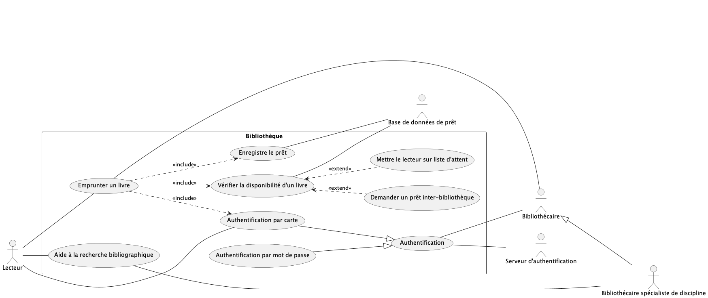

# Bibliothèque

Réalisez un diagramme de cas d’utilisation pour les services offerts par une bibliothèque en vous basant sur la description suivante. 

La bibliothèque offre deux services principaux à ses clients appelés « Lecteurs ». D’une part, ils peuvent emprunter un livre, et d’autre part ils peuvent obtenir une aide à la recherche bibliographique auprès de bibliothécaires spécialistes de discipline.

L’emprunt de livre se fait normalement en trois étapes auprès d’un bibliothécaire. Le lecteur s’identifie au moyen de sa carte de lecteur, le bibliothécaire vérifie la disponibilité du livre dans la base de données de prêt et y enregistre le prêt. 

Le bibliothécaire doit également s’authentifier dans le système. Il peut le faire par carte ou par mot de passe. Toutes les authentifications sont validées par le serveur d’authentification 

Lors de la vérification de la disponibilité d’un livre, si celui-ci n’est pas disponible, il peut être demandé en prêt inter-bibliothèque, ou le lecteur peut être mis sur liste d’attente. 

Si nécessaire pour le bon fonctionnement du service, un bibliothécaire spécialiste de discipline peut remplacer un bibliothécaire pour toutes ses tâches. 

## Diagramme de cas d'utilisation

